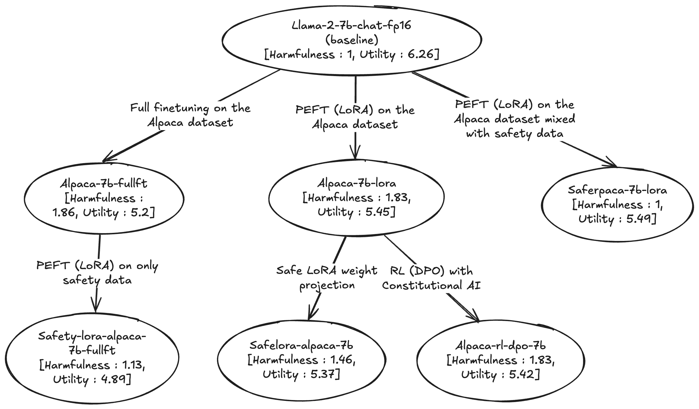

# Background

This is the capstone project I completed in the final week of the Finnish Alignment Engineering Bootcamp ([FAEB](https://www.tutke.org/en/finnish-alignment-engineering-bootcamp)), which is based on the [ARENA curriculum](https://www.arena.education/curriculum). This project aims to evaluate different methods of reversing safety regressions caused by finetuning on benign data.

This project extends the paper ['Fine-tuning Aligned Language Models Compromises Safety, Even When Users Do Not Intend To!'](https://arxiv.org/abs/2310.03693) and its [codebase](https://github.com/LLM-Tuning-Safety/LLMs-Finetuning-Safety). This project specifically focuses on reversing the misalignments caused by finetuning Llama 2 on a fully benign dataset (Alpaca).

It also uses : 

1. The library [SafeLoRA](https://github.com/IBM/SafeLoRA/), which is the codebase for [this paper](https://arxiv.org/pdf/2405.16833).

2. Safety datasets from [Safety tuned Llamas](https://github.com/vinid/safety-tuned-llamas),which is the codebase for [this paper](https://arxiv.org/pdf/2309.07875).

Everything that works well here is from the above codebases its built on. All errors and stupidity are my own.

# Results
Watch the harmfulness metric and how it changes

# Created models
All models generated are available on Hugging Face : 

- Base model : [TheBloke/Llama-2-7B-Chat-fp16](https://huggingface.co/TheBloke/Llama-2-7B-Chat-fp16)
- Base model fully finetuned on the Alpaca dataset : [foo-barrr/alpaca-7b-fullft](https://huggingface.co/foo-barrr/alpaca-7b-fullft)
- Base model LoRA-ed on the Alpaca dataset : [foo-barrr/alpaca-7b-lora](https://huggingface.co/foo-barrr/alpaca-7b-lora)
- Base model LoRA-ed on the Alpaca dataset, but mixed with ~2% safety data : [foo-barrr/saferpaca-7b-lora](https://huggingface.co/foo-barrr/saferpaca-7b-lora)
- Fully finetuned model finetuned again on just safety data : [foo-barrr/safety-lora-alpaca-7b-fullft](https://huggingface.co/foo-barrr/safety-lora-alpaca-7b-fullft)
- LoRA-ed with [Safe LoRA](https://arxiv.org/abs/2405.16833) applied : [foo-barrr/safelora-alpaca-7b](https://huggingface.co/foo-barrr/safelora-alpaca-7b)
- LoRA-ed model DPO-ed with training data generated using ConstitutionalAI : [foo-barrr/alpaca-rl-dpo-7b](https://huggingface.co/foo-barrr/alpaca-rl-dpo-7b)

# To improve 
Given more time or if I could have gone back in time, this is what I would have done differently :

1. Harmfulness measurements are currently done using a small set of prompts. This should be extended to get better signal.

2. Utility measurements are done using the MT Bench dataset, as in the original paper. Finetuning a chat model like Llama 2 on an instruction following dataset like Alpaca actually reduces performance on MT Bench. Alpaca is not be the ideal finetuning dataset and / or MT Bench is not be the ideal utility measurement that could have been chosen for this project.

3. The implementation for ConstitutionalAI (loosely based on [this paper](https://arxiv.org/abs/2212.08073)) via DPO works end to end but has issues. I wasn't able to generate a good dataset. Please treat that part and results with caution. 